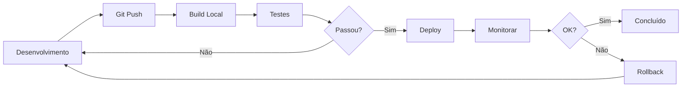

# ?? Documentação de Deploy - SW Portal Proprietário

## ?? Índice de Documentação

### ?? Guias Completos

1. **[DEPLOY_LINUX.md](./DEPLOY_LINUX.md)** - Guia Completo de Deploy em Linux
   - Instalação de todos os componentes
   - Configuração detalhada de cada serviço
   - Troubleshooting completo
   - Scripts de manutenção

2. **[QUICK_DEPLOY.md](./QUICK_DEPLOY.md)** - Guia Rápido de Deploy
   - Início rápido em 3 passos
   - Checklist de deploy
   - Comandos úteis
   - Troubleshooting rápido

### ?? Scripts Disponíveis

Consulte [../scripts/README.md](../scripts/README.md) para documentação detalhada dos scripts.

#### Scripts de Deploy
- `build-and-publish.sh` - Build e publicação da aplicação
- `build-and-publish.ps1` - Versão Windows (PowerShell)
- `deploy.sh` - Deploy automatizado para servidor Linux
- `install-server.sh` - Instalação automatizada de componentes no servidor

#### Scripts de Manutenção
- `monitor.sh` - Monitoramento de serviços e recursos
- `backup.sh` - Backup automático completo
- `restore.sh` - Restauração de backup

---

## ?? Início Rápido

### Para Deploy pela Primeira Vez

1. **Preparar o servidor:**
   ```bash
   # No servidor Linux (como root)
   curl -fsSL https://raw.githubusercontent.com/glebersonsm/SW_PortalProprietario_BeachPark.API/master/scripts/install-server.sh | bash
   ```

2. **Configurar ambiente de produção:**
   ```bash
   # No seu computador local
   cp .env .env.production
   nano .env.production  # Editar valores
   ```

3. **Deploy:**
   ```bash
   chmod +x scripts/*.sh
   ./scripts/deploy.sh
   ```

### Para Updates/Redeploys

```bash
# Fazer alterações, testar, commit
git push origin master

# Deploy
./scripts/deploy.sh

# Monitorar
./scripts/monitor.sh
```

---

## ?? Arquitetura do Sistema

```
???????????????????????????????????????????????????????????????
?                      Internet / Usuários                      ?
???????????????????????????????????????????????????????????????
                         ?
                    HTTPS (443)
                         ?
                         ?
??????????????????????????????????????????????????????????????
?                      Nginx (Reverse Proxy)                  ?
?  - SSL/TLS Termination                                      ?
?  - Static Files                                             ?
?  - Load Balancing                                           ?
??????????????????????????????????????????????????????????????
                         ?
                    HTTP (5000)
                         ?
                         ?
??????????????????????????????????????????????????????????????
?                    .NET 8 API (Kestrel)                     ?
?  - SW_PortalCliente_BeachPark.API                           ?
?  - Controllers, Services, Domain Logic                      ?
??????????????????????????????????????????????????????????????
  ?          ?          ?          ?           ?
  ?          ?          ?          ?           ?
  ?          ?          ?          ?           ?
??????  ??????????  ????????  ??????????  ???????????
? DB ?  ? Redis  ?  ? Logs ?  ?RabbitMQ?  ?Files    ?
?PgSQL?  ? Cache  ?  ?Journal?  ? Queue ?  ?wwwroot/ ?
??????  ??????????  ????????  ??????????  ???????????
```

---

## ??? Estrutura de Diretórios

```
/var/www/swportal/                    # Aplicação principal
??? SW_PortalCliente_BeachPark.API.dll
??? .env                              # Configurações de produção
??? appsettings.json
??? appsettings.Production.json
??? wwwroot/                          # Arquivos estáticos
?   ??? images/
?   ?   ??? grupos/
?   ??? documents/                    # Documentos gerais
?   ??? pdfs/
?   ?   ??? comunicacoes/             # PDFs de comunicações
?   ?   ??? boletos/                  # PDFs de boletos
?   ??? certidoes/
?       ??? modelos/                  # Templates de certidões
?       ??? pdf/                      # Certidões geradas
?       ??? contratos/                # Contratos SCP
??? scripts/                          # Scripts de manutenção

/backup/swportal/                     # Backups
??? db_YYYYMMDD_HHMMSS.sql.gz        # Banco de dados
??? files_YYYYMMDD_HHMMSS.tar.gz     # Arquivos
??? config_YYYYMMDD_HHMMSS.tar.gz    # Configurações
??? backup.log                        # Log de backups

/etc/nginx/sites-available/
??? swportal-api                      # Configuração Nginx

/etc/systemd/system/
??? swportal-api.service              # Serviço systemd

/var/log/nginx/
??? swportal-api-access.log           # Logs de acesso
??? swportal-api-error.log            # Logs de erro
```

---

## ?? Segurança

### Variáveis Sensíveis

As seguintes variáveis **NÃO DEVEM** ser commitadas no Git:
- Senhas de banco de dados
- Chaves JWT
- Senhas de Redis
- Credenciais de SMTP
- Chaves de API de terceiros

Use o arquivo `.env.production` (que está no `.gitignore`).

### Checklist de Segurança

- [ ] Firewall configurado (apenas portas 22, 80, 443 abertas)
- [ ] PostgreSQL aceitando apenas conexões locais
- [ ] Redis com senha configurada
- [ ] RabbitMQ com usuário não-padrão
- [ ] JWT com chave forte (mínimo 32 caracteres)
- [ ] SSL/TLS configurado (Let's Encrypt)
- [ ] Usuário não-root para rodar a aplicação (`www-data`)
- [ ] Logs sendo rotacionados
- [ ] Backups automáticos configurados
- [ ] Fail2ban configurado (opcional mas recomendado)

---

## ?? CI/CD

### Workflow Recomendado



### GitHub Actions (Opcional)

Para automatizar ainda mais, você pode criar um workflow do GitHub Actions:

```yaml
# .github/workflows/deploy.yml
name: Deploy to Production

on:
  push:
    branches: [ master ]

jobs:
  deploy:
    runs-on: ubuntu-latest
    steps:
      - uses: actions/checkout@v2
      - name: Setup .NET
        uses: actions/setup-dotnet@v1
        with:
          dotnet-version: 8.0.x
      - name: Build
        run: dotnet build
      - name: Test
        run: dotnet test
      - name: Deploy
        run: ./scripts/deploy.sh
```

---

## ?? Monitoramento

### Logs Importantes

```bash
# API
sudo journalctl -u swportal-api.service -f

# Nginx
sudo tail -f /var/log/nginx/swportal-api-access.log
sudo tail -f /var/log/nginx/swportal-api-error.log

# PostgreSQL
sudo tail -f /var/log/postgresql/postgresql-*-main.log

# Redis
sudo tail -f /var/log/redis/redis-server.log

# RabbitMQ
sudo rabbitmqctl list_queues
```

### Métricas Importantes

- Uso de CPU
- Uso de memória
- Espaço em disco
- Latência de resposta da API
- Taxa de erros
- Tamanho das filas do RabbitMQ
- Conexões ativas do banco de dados

### Ferramentas Recomendadas (Opcional)

- **Prometheus + Grafana** - Métricas e dashboards
- **ELK Stack** - Análise de logs
- **Sentry** - Tracking de erros
- **Uptime Robot** - Monitoramento de disponibilidade

---

## ?? Suporte

### Documentação

- [Guia Completo de Deploy](./DEPLOY_LINUX.md)
- [Guia Rápido](./QUICK_DEPLOY.md)
- [Scripts](../scripts/README.md)

### Contato

- **Email:** contato@swsolucoes.inf.br
- **Website:** https://www.swsolucoes.inf.br
- **GitHub:** https://github.com/glebersonsm/SW_PortalProprietario_BeachPark.API

### Issues

Para reportar problemas ou sugerir melhorias:
https://github.com/glebersonsm/SW_PortalProprietario_BeachPark.API/issues

---

## ?? Changelog

### v1.0.0 (2024-01)
- Documentação completa de deploy
- Scripts automatizados
- Guias de troubleshooting
- Sistema de backup/restore

---

## ?? Licença

© 2024 SW Soluções Integradas Ltda. Todos os direitos reservados.

---

**Última atualização:** Janeiro 2024
